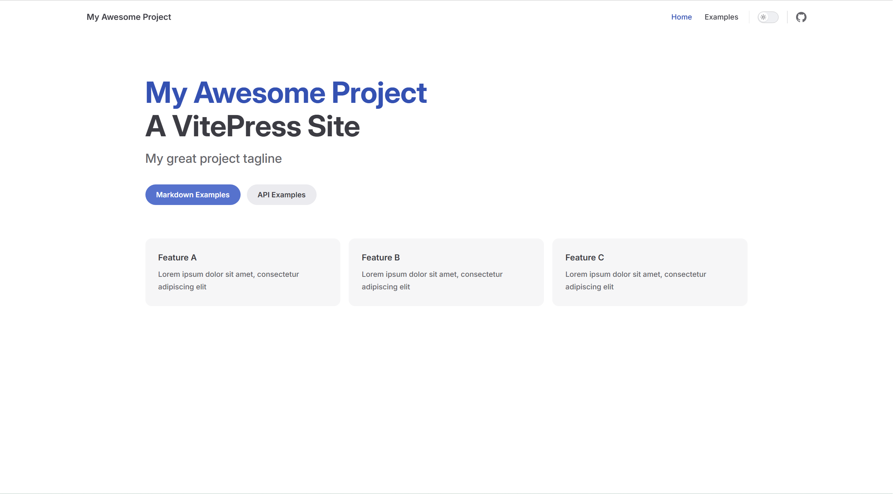

# Vitepress搭建

首先，我们创建一个项目，然后安装 vitepress 编辑器我使用的是 vscod

## 安装 vitepress

``` pnpm
pnpm add -D vitepress
```

## 初始化 Vitepress

``` pnpm
pnpm vitepress init
```

## 启动项目

``` pnpm
pnpm docs:dev
```

# Vitepress部署

## 使用 Github Pages 部署

Github Pages 专门用来托管静态内容，由于不需要服务器且基于 git，支持 CI/CD，成为很多静态网站比如博客、文档网站的很好的选择

### 在项目目录下创建 .gitignore文件,
```
node_modules
.vitepress/cache
.vitepress/dist
dist
.DS_Store
*.log
.temp
.cache
.env
.env.*
!.env.example
```

### 在config.mts文件中添加 base配置
```
export default defineConfig({

  base: '/github仓库名/', 

  ......

})
```
> 这里一定要记得写，不然样式会出问题，然后写上自己的仓库名

### 在config.mts文件中修改图标路径
```
head: [
  ['link', { rel: 'icon', href: '/github仓库名/xxxx.jpg' }],
];
```

### 将代码提交到github仓库中

#### 1）初始化 git 本地仓库
```
git init 
```
>初始化就是创建一个git仓库

#### 2）将文件添加到 Git 的暂存区
```
git add .
```
>.代表全部文件 

#### 3）将暂存区的文件更改提交到本地仓库
```
git commit -m "first commit"
```
> -m "xxx" 选项后面跟着的是本次提交的说明信息

#### 4）添加远程仓库地址到本地
```
git remote add origin 远程仓库地址
```
>git remote 命令用于管理远程仓库。
>add 子命令用于添加一个新的远程仓库。
>origin 是远程仓库的默认名称，后面跟着的是远程仓库的 URL。

#### 5）管理 Git 分支
```
git branch -M main
```
> -M 选项是强制重命名分支的意思，将当前分支重命名为 main

> 在过去，很多 Git 仓库默认的主分支名称是 master，但现在越来越多的项目使用 main 作为主支名称。

#### 6） 将本地仓库的提交送到远程仓库
```
git push -u origin main
```
>-u 选项表示同时设置上游（远程）分支，这样以后在执行 git push 或 git pull 时就可以省略指定远程仓库和分支的参数。origin 是远程仓库的名称，main 是要推送的分支名称。

### 选择github actions
![[Pasted image 20250531124907.png]]

### 设置工作流

![[Pasted image 20250531125107.png]]

### 重命名 deploy.yml 并设置deploy脚本

![[Pasted image 20250531125216.png]]

### 创建.github/workflows/deploy.yml 文件或者.yaml 文件
```
# 构建 VitePress 站点并将其部署到 GitHub Pages 的示例工作流程
#
name: Deploy VitePress site to Pages

on:
  # 在针对 `main` 分支的推送上运行。如果你
  # 使用 `master` 分支作为默认分支，请将其更改为 `master`
  push:
    branches: [main]

  # 允许你从 Actions 选项卡手动运行此工作流程
  workflow_dispatch:

# 设置 GITHUB_TOKEN 的权限，以允许部署到 GitHub Pages
permissions:
  contents: read
  pages: write
  id-token: write

# 只允许同时进行一次部署，跳过正在运行和最新队列之间的运行队列
# 但是，不要取消正在进行的运行，因为我们希望允许这些生产部署完成
concurrency:
  group: pages
  cancel-in-progress: false

jobs:
  # 构建工作
  build:
    runs-on: ubuntu-latest
    steps:
      - name: Checkout
        uses: actions/checkout@v4
        with:
          fetch-depth: 0 # 如果未启用 lastUpdated，则不需要
      - uses: pnpm/action-setup@v3 # 如果使用 pnpm，请取消此区域注释
        with:
          version: 9
      # - uses: oven-sh/setup-bun@v1 # 如果使用 Bun，请取消注释
      - name: Setup Node
        uses: actions/setup-node@v4
        with:
          node-version: 22
          cache: pnpm # 或 pnpm / yarn
      - name: Setup Pages
        uses: actions/configure-pages@v4
      - name: Install dependencies
        run: pnpm install # 或 pnpm install / yarn install / bun install
      - name: Build with VitePress
        run: pnpm docs:build # 或 pnpm docs:build / yarn docs:build / bun run docs:build
      - name: Upload artifact
        uses: actions/upload-pages-artifact@v3
        with:
          path: .vitepress/dist

  # 部署工作
  deploy:
    environment:
      name: github-pages
      url: ${{ steps.deployment.outputs.page_url }}
    needs: build
    runs-on: ubuntu-latest
    name: Deploy
    steps:
      - name: Deploy to GitHub Pages
        id: deployment
        uses: actions/deploy-pages@v4
```
>deploy.yml 文件或者.yaml 文件这两个文件都可以

### 点击确定，耐心等待三分钟左右，就可以了，接下来查看我们的域名

![[Pasted image 20250531125551.png]]

### 最后，就部署完毕了



